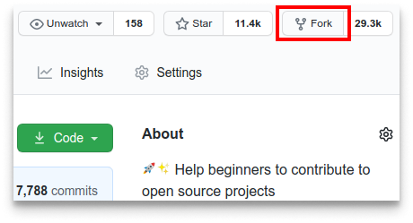
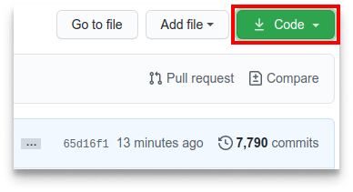

# HTMLzão da massa
*(contribuições - juntos vamos mais longe)*


## tutorial

É difícil. É sempre difícil fazer algo pela primeira vez. Especialmente quando se está colaborando, cometer erros não é algo agradável. Mas *open source* (código aberto) se trata de colaboração e de trabalharmos juntos. Queremos simplificar a forma com que novos colaboradores *open source* aprendem e contribuem pela primeira vez.

Ler artigos e ver tutoriais pode ajudar, mas o que é melhor do que realmente pôr a mão na massa em um ambiente prático? Este projeto visa guiar e simplificar a forma com que os novatos fazem a sua primeira contribuição. Se quiser fazer a sua primeira contribuição, siga os passos abaixo.



## Faça um Fork deste repositório

Faça um Fork clicando no botão "Fork" no topo desta página. Isto irá criar uma cópia deste repositório na sua conta.

## Clone o repositório



Agora clone este repositório para a sua máquina. Clique no botão "Clone or download" e, em seguida, clique no ícone "Copy to clipboard" para copiar a URL.

Abra seu terminal e execute o seguinte comando do git:
```
git clone "url que copiou"
```
onde "url que copiou" (sem as aspas) é a URL deste repositório. Consulte as etapas anteriores para obter a URL.


Por exemplo:
```
git clone git@github.com:seu-usuário/HTMLzao-da-massa.git
```
onde "seu-usuário" é o seu usuário do GitHub. Aqui você está copiando o conteúdo do repositório HTMLzao-da-massa para o seu computador.

## Crie um Branch

Vá para o diretório do repositório no seu computador (caso você não esteja lá):
```
cd HTMLzao-da-massa-seu-nome
```

Agora crie um Branch usando o comando `git checkout`:
```
git checkout -b <add-seu-nome>
```

Por exemplo:
```
git checkout -b add-alonzo-church
```
Obs.: O nome do Branch não precisa ter a sigla "add", mas nesse caso é recomendável, porque a finalidade deste Branch é a de adicionar o seu nome à uma lista.

## Efetue as alterações necessárias e faça um Commit

- Adicione uma imagem e uma frase no arquivo `index.html`
- Adicione seu nome no arquivo `pessoas_contribuidoras.md`
- Adicione as mudança `git add .`
- Faça o commit `git commit -m "sua mensagem aqui"`  


Se você for para o diretório do projeto e executar o comando `git status`, verá que há alterações. Adicione essas alterações ao Branch que você acabou de criar utilizando o comando `git add`:
```
git add .
```
Agora faça um Commit dessas alterações utilizando o comando `git commit`:
```
git commit -m "Add <seu-nome> to Contributors list"
```
preenchendo `<seu-nome>` com o seu nome.

## Faça um Push das alterações para o GitHub

Faça um Push utilizando o comando `git push`:
```
git push origin <add-seu-nome>
```
substituindo `<add-seu-nome>` pelo nome do Branch que você criou anteriormente.

## Envie suas alterações para serem revisadas

Se você for para o seu repositório no GitHub, verá um botão `Compare & pull request`. Clique nesse botão.


Agora envie um Pull Request.


Logo estarei mesclando ('mergeando') as suas mudanças no Branch principal (master) deste projeto. Você receberá um e-mail de notificação quando as alterações forem mescladas.

#VQV :rocket:
